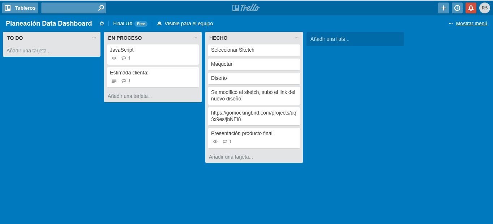
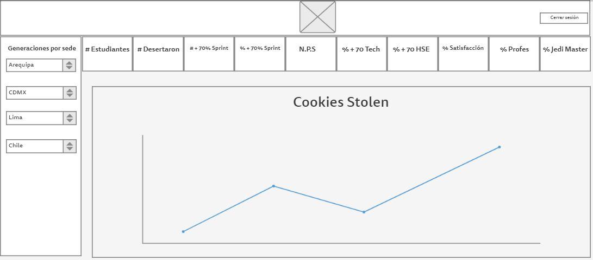
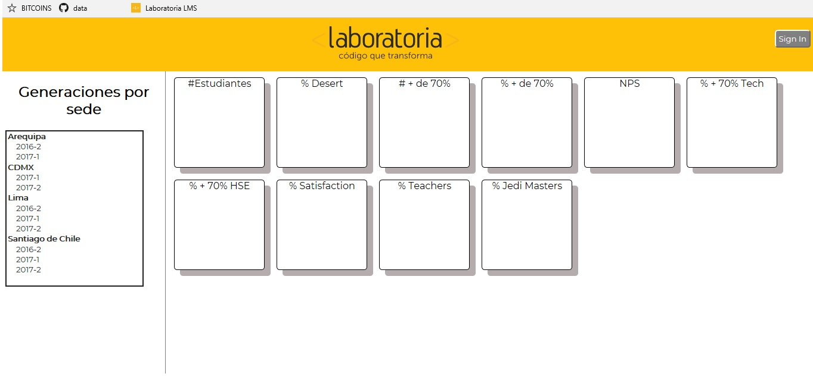

# Dashboard

Administra tus datos de manera sencilla y dispon de ellos desde la comodidad de la web.

### Acerca de
Dashboard Laboratoria es un software de administración de informacion. Diseñado para Training Managers (TMs) de laboratoria.

### Pre-requisitos

Requiere explorador web.

Chrome, Safari, Internet explorer...





#PRESENTACION: https://prezi.com/3mykxs_szqfw/edit/#0

### Descripcion
ES una herramienta web donde puedan ver datos fácil y rápidamente. Estos son los datos que revisan normalmente:

* El total de estudiantes presentes por sede y generación.
* El porcentaje de deserción de estudiantes.
* La cantidad de estudiantes que superan la meta de puntos en promedio de todos los sprints cursados. La meta de puntos es 70% del total de puntos en HSE y en tech.
* El porcentaje que representa el dato anterior en relación al total de estudiantes.
* El Net Promoter Score (NPS) promedio de los sprints cursados. El NPS se calcula en base a la encuesta que las estudiantes responden al respecto de la recomendación que darían de Laboratoria, bajo la siguiente fórmula:

[Promoters] = [Respuestas 9 o 10] / [Total respuestas] * 100
[Passive] = [Respuestas 7 u 8] / [Total respuestas] * 100
[Detractors] = [Respuestas entre 1 y 6] / [Total respuestas] * 100

[NPS] = [Promoters] - [Detractors]
* La cantidad y el porcentaje que representa el total de estudiantes que superan la meta de puntos técnicos en promedio y por sprint.
* La cantidad y el porcentaje que representa el total de estudiantes que superan la meta de puntos de HSE en promedio y por sprint.
* El porcentaje de estudiantes satisfechas con la experiencia de Laboratoria.
* La puntuación promedio de l@s profesores.
* La puntuación promedio de l@s jedi masters.


## < l a b o r a t o r i a >

* **Track:** _Common Core_
* **Curso:** _Creando tu primer sitio web interactivo_
* **Unidad:** _Producto final_

***

## Flujo de trabajo

1. Debes realizar un [**fork**](https://gist.github.com/ivandevp/1de47ae69a5e139a6622d78c882e1f74)
   de este repositorio.

2. Luego deberás **clonar** tu fork en tu máquina. Recuerda que el comando a usar
   es `git clone` y su estructura normalmente se ve así:

   ```bash
   git clone https://github.com/<nombre-de-usuario>/freelancer.git
   ```

3. Cuando hayas terminado tu producto, envía un Pull Request a este repositorio
   (puedes solicitar apoyo de tus profes para este paso).

> Nota: No olvides que es una buena práctica describir tu proyecto en este
> archivo `README.md` y también desplegar tu web a Github Pages :smiley:.
